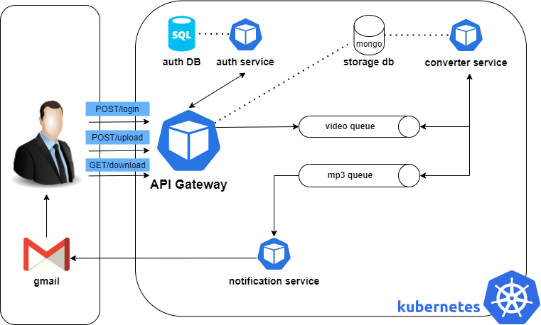

# Optimization of Kubernetes resources for movie files processing

Project was prepared for Large Scale Computing classes on AGH University of Science and Technology.

## Introduction
In this project a simple REST API application created with microservices architecture was proposed. It provides the ability for users to convert a video file into mp3 file. Services are contenerized with use of
Docker and orchestrated by Kubernetes. As the main purpose of the project was to optimize resources of k8s deployment, each component is responsible for a different functionality. This approach allows to keep
system design simplicity and assure the independence in matter of resources management (e.g. scalability).

Full project documentation containing details of:
* **Architecture**
* **Communication**
* **Deployment**
* **End-to-end tests**

is available here: [Optimization of kubernetes resources for movie files processing](./docs-res/Optimization_of_k8s_resources.pdf)

***
## Microservices architecture

**Technology stack:**

The project was prepared on WSL Ubuntu.

* **Development**

    Python, Flask

* **Database**

    mySQL, MongoDB

* **Deployment**

    Docker, Kubernetes (minikube), k9s
***
## Running the app

### Prerequisites:

* Preferably a Linux environment (Linux vm is a great choice)

* Docker

* Kubernetes cluster. While installing a full-fledged cluster is quite complicated, it’s possible to prepare a development “mini k8s cluster” with help of minikube https://minikube.sigs.k8s.io/docs/start/.

Clone repository

    git clone https://github.com/jakeinrock/Optimization-of-kuberenetes-resources.git

**The sensitive content of kubernetes secret manifests and .env files need to be replaced with your data.**

Run minikube

    minikube start

To apply/delete all kubernetes manifests run the following bash scripts:

    bash apply.sh
    bash delete.sh

Run minikube tunnel

    minikube tunnel

The app will be available at:

    http://mp3converter.com